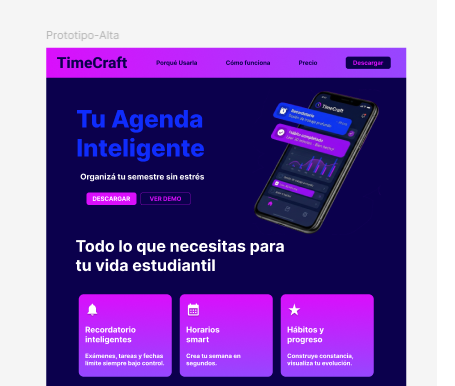
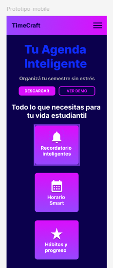

# Landing Page TimeCraft

Landing page del proyecto TimeCraft desarrollada con HTML, SASS y Bootstrap.

## Descripcion 

Esta landing page fue diseñada para promocionar TimeCraft, una agenda digital pensada para estudiantes que buscan organizar sus tareas, exámenes, horarios y hábitos de estudio de manera simple, visual e intuitiva. La página presenta las principales funcionalidades de la aplicación, sus beneficios y testimonios de usuarios, con un diseño moderno y responsive enfocado en mejorar la experiencia del usuario.

## Objetivo

El objetivo principal de esta landing page es dar a conocer la aplicación TimeCraft y motivar su descarga, mostrando de forma clara cómo la herramienta ayuda a los estudiantes a optimizar su tiempo, reducir el estrés académico y mejorar su organización diaria. Además, busca generar confianza a través de historias reales y destacar el valor diferencial de la app frente a métodos tradicionales de planificación.

## Prototipo en Figma
Este proyecto cuenta con un diseño previo realizado en Figma para planificar la estructura y experiencia de usuario de la landing page.

[Ver diseño en Figma](https://www.figma.com/design/UfE4bgfZsVyXYTwkcHmUoj/Untitled?node-id=0-1&t=vUzPJvUj7oHVU2zl-1)

git pull
## Link al deploy en GitHub Pages

[Ver GitHub Page](https://agustina-prog.github.io/LandingPage-TimeCraft/)

## Tecnologias utilizadas 

-Html
-Css
-Sass
-Boostrap
-Animate
-JS

## Autor

Agustina Juarez